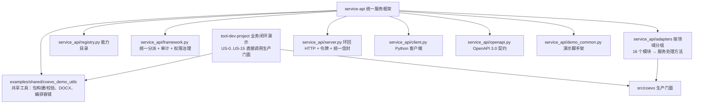

# Coevo 项目代码详细注释导览（Code Guide）

本文档对 `src/coevo` 全部领域模块、协议层、应用组合根与 `examples/`
演示层做逐模块的**详细注释**：职责边界、关键类与方法（含参数/返回/错误语义）、
模块间调用链与数据流、安全不变量。阅读顺序建议：总览 → 分层 → 领域模块 →
协议层 → 应用组合根 → 示例层。

> 约定：本文档是**注释导览**，不是需求文档。需求与验收标准以
> `docs/requirements/` 与 `docs/traceability/requirements-test-matrix.md` 为准；
> 冲突时以强制性技术约束为准。

---

## 一、总览与分层

```
examples/                    应用/演示层（本仓库的可运行示例与一致性 API 框架）
src/coevo/                   生产代码
├─ app/                      应用组合根（pipeline / demo_support）
├─ identity/                 身份与信任（US-0）
├─ task_flow/                任务流程理解（US-1）
├─ task_decomposition/       任务分解（US-2）
├─ talent/                   团队组建（US-3）
├─ orchestrator/             运行中枢（US-4）
├─ protocol/                 任务包协议（US-5，`.agent`）
├─ workspace/                工作区初始化（US-6）
├─ cockpit/                  本地驾驶舱（US-7）
├─ progress_capture/         进展采集（US-8）
├─ report/                   成果回传（US-9）
├─ merge/                    状态合并（US-10）
├─ risk/                     风险预警（US-11）
├─ supervision/              督办与会议协同（US-12）
├─ decision_brief/           决策简报（US-13）
├─ knowledge_base/           知识沉淀（US-14）
├─ audit_governance/         安全审计（US-15）
├─ crypto/                   国密引擎适配（SM2/SM3/SM4）
├─ benchmarks/               可扩展性探针
├─ config.py / version.py / logging_setup.py / records_archive.py
scripts/                     工程底座与运维脚本
tests/                       单元/集成/安全/端到端/Win7 测试
```

跨模块设计不变量（所有模块共同遵守）：

1. **失败关闭**：任何输入不满足契约即抛错，绝不静默降级。
2. **版本优先于时间戳**：流程/基线/主版本一律用整数版本号，ISO-8601 UTC `Z`
   时间仅作信息展示。
3. **状态变更须人工确认**：编排、合并、风险发布、简报、知识入库都有确认节点；
   模型/规则输出不直接写正式状态。
4. **全程审计**：各服务提供 `to_audit_record`，敏感文本只保留哈希/计数。
5. **不落明文密钥**：私钥字节不进入 Python 进程，只经受控助手返回密码运算结果。
6. **纯函数优先**：领域服务层尽量无 IO/无网络，持久化由独立仓库层承担。

---

## 二、领域模块逐一注释

### 2.1 `identity/` —— 身份与信任（US-0）

| 文件 | 职责与关键注释 |
|---|---|
| `models.py` | `Actor`/`Organization`/`UserIdentity`/`ClientIdentity`/`TrustedCertificate`/`ProjectRoleBinding`/`IdentityBundle`/`RegistrationResult`。证书模型含 `fingerprint_sha256`（由 DER 计算）与 `revoked`，仓库层以该指纹做唯一约束（防证书复用）。 |
| `certificates.py` | `inspect_certificate(der)` 通过受控 PowerShell 助手（`inspect_certificate.ps1`）解析 X.509：返回指纹、SPKI、有效期、序列号、算法 OID；`has_private_key` 必须为 False，输出与输入 DER 摘要必须一致（防替包）。 |
| `validation.py` | `validate_bundle` 校验身份包五要素一致性（组织/用户/终端/证书/角色引用互锁）；`reject_sensitive_input` 拒绝私钥/口令等敏感键；角色码闭集 `{"project_owner","project_member"}`。 |
| `private_keys.py` | `PrivateKeyReference` 只携带元数据（键名/OID/公钥摘要/有效期/绑定证书），**绝不携带私钥字节**；`PrivateKeyService` 经 Windows CNG 助手完成签名等密码运算。 |
| `repository.py` | SQLite 持久化 + `SignedAuditAnchor` 审计锚点；`register` 原子写五张业务表 + 审计事件，证书指纹唯一约束冲突即回滚并记 `conflict`。 |
| `service.py` | `IdentityService.register_identity_bundle(actor, request_id, payload)`：鉴权 `identity:write` → 校验 → 注册 → 审计；同 `request_id` 重放返回 `replayed=True`（幂等）。 |
| `audit_anchor.py` | 审计锚点：`SignedAuditAnchor` 封装数据库绑定摘要链 + 签名检查点 + 撤销墓碑，实现审计篡改可检测。 |

调用链：`IdentityService → IdentityRepository → SignedAuditAnchor`；证书解析走
`certificates.inspect_certificate → scripts/inspect_certificate.ps1`。

### 2.2 `task_flow/` —— 任务流程理解（US-1）

| 文件 | 职责与关键注释 |
|---|---|
| `models.py` | `Traced`（字段值+来源路径+置信度+来源类型）、`ProcessFlow`（不可变，`version` 严格单调递增）、`Override`（评审编辑留痕）、`StandardStage` 六阶段闭集枚举。 |
| `parser.py` | `parse_flow` 支持 `canonical/tabular/tree` 三种 schema，统一归约为规范形；重复 ID、非法类型、置信度越界全部 fail-closed。 |
| `mapping.py` | `apply_mapping` 用规则表把单位 `stage_hint` 映射到 `StandardStage`；`DEFAULT_MAPPING_RULES` 27 条（中英文 hint），规则集带版本。 |
| `service.py` | `FlowUnderstandingService.understand` 一次返回 `FlowUnderstanding`（flow + mapped + graph + reviewer_view）；`confirm` 以 Override 升版本；`to_audit_record` 只记结构事实。 |

数据流：流程资料 → `parse_flow` → `apply_mapping` → `StageGraph`（US-2 依赖）
→ 负责人确认（`confirm`）→ 带版本流程模型。

### 2.3 `task_decomposition/` —— 任务分解（US-2）

| 文件 | 职责与关键注释 |
|---|---|
| `models.py` | `Task`/`WorkPackage`/`Milestone`/`DependencyEdge`（仅 `fs` 类型）/`ProjectBaseline`（冻结、版本单调）。 |
| `dependency_graph.py` | `build_dependency_graph` 阶段顺序种子边 + 显式边，拓扑排序（O(E)）与环检测 fail-closed。 |
| `baseline.py` | `build_baseline` 构造 v1 基线；`confirm_baseline` 升版本；每次确认全量重校验。 |
| `editing.py` | `add_task/remove_task/update_task/reorder_tasks` 四个纯函数编辑，每次经 `build_baseline` 全量校验并追加 `Override` 审计记录（US-2 AC-6）。 |
| `service.py` | `TaskDecompositionService.propose(understanding, project_input)` 按标准阶段分组生成工作包/任务/交付物。 |

数据流：`FlowUnderstanding` → `propose` → `build_baseline` → 人工编辑/确认 → 基线。

### 2.4 `talent/` —— 团队组建（US-3）

| 文件 | 职责与关键注释 |
|---|---|
| `models.py` | `Talent`（字段最小契约：代号/技能标签/资质/负荷/可用窗口/脱敏身份）；`RedactedIdentity` 只有代号+显示提示+身份哈希，原始 PII 永不进入模型。 |
| `redaction.py` | `redact_identity` 不可逆脱敏（哈希 + 有界显示提示）。 |
| `recommender.py` | 确定性评分：技能 +2.0、资质 +1.0、窗口全含 +1.5/部分 +0.5、负荷余量 +1.0；`LoadAlert`（AT_CAPACITY/OVER_CAPACITY/WINDOW_CONFLICT）。 |
| `store.py` | SQLite 持久化 + 哈希链 + 逐行校验 + `talent_from_import` 导入即脱敏。 |
| `service.py` | `TalentRecommenderService.recommend_for_requirements(pool, requirements)` 门面。 |

### 2.5 `orchestrator/` —— 运行中枢（US-4）

| 文件 | 职责与关键注释 |
|---|---|
| `models.py` | `AgentSpec/AgentRegistration/AgentRegistry`（不可变注册表）、`AgentCapability` 11 类闭集、`OrchestrationStep`、`FailurePolicy`（RETRY/SKIP/ESCALATE_HUMAN）、`MVP_FIXED_CHAIN`（5 步固定下发链：流程理解→分解→推荐→人工确认→生成包）。 |
| `service.py` | `Orchestrator.dispatch_event / confirm_human / dispatch_event_with_real_facades / confirm_real_chain / resume_real_chain` 两阶段受控编排。 |
| `_real_chain.py` | 真实门面链执行器：`RealChainExecutor`（flow/decomp/talent + 人才库）、`dispatch_real_chain`（前三步原子执行并停在第 4 步人工确认）、`confirm_real_chain`（授权校验 + 确认摘要）、`resume_real_chain`（第 5 步生成加密包并回读校验）。 |
| `real_chain_store.py` | 编排记录 + 审计链 SQLite 存储；`SignedAuditAnchor` 提升失败 → `RealChainStoreRecoveryRequired`，提供 `recover()`。 |

安全要点：第 4 步人工确认必须过 `StaticAuthorizer` 的
`orchestrator:confirm-package:<project>` 权限；确认摘要与事件摘要绑定存储，
防止跳过确认直接生成包。

### 2.6 `protocol/` —— `.agent` 任务包协议（US-5）

| 文件 | 职责与关键注释 |
|---|---|
| `agent_package.py` | 36 字节固定头 + 规范信封 `EnvelopeHeader`；严格拒绝非规范 JSON、未知枚举、长度矛盾、非法 nonce、尾随数据；`build_envelope_template` 生成默认一年有效期信封。 |
| `package_builder.py` | `build_encrypted_package`（SM2 封钥 + SM4-GCM 加密载荷 + 发送方签名）；`open_encrypted_package` 严格解密/验签/回读，句柄证书必须与信封一致（错误接收人拒绝）。 |
| `agent_payload.py` | 内层载荷（content/manifest.json/sender.sig）规范编码。 |
| `sm2_sign.py` / `sm2_keywrap.py` | SM3 摘要、SM2 签名与密钥封装（经 GmSSL 助手）。 |
| `import_transaction.py` | 7 步原子导入状态机（解密检查→准备→写文件→准备库→提交→提升→清理），失败回滚。 |
| `processed_package_store.py` / `package_store_db.py` | 内存/SQLite 已处理包登记表（§17），`package_id/digest` 重复拒绝。 |
| `replay_detector.py` | §17 重放检测：重复包 ID/重复摘要/序号重放/撤销/非法引用 → `ReplayDecision`。 |
| `import_service.py` | `PackageImportService.import_package` 门面：重放决策 + 原子导入 → `ImportOutcome`。 |

### 2.7 `workspace/` —— 工作区初始化（US-6）

`paths.py`（安全路径策略：`QuarantinePath`/`WorkspacePath`/`WorkspacePaths`，
拒绝 `..`/绝对路径/设备前缀/符号链接越界）→ `models.py`（`WorkspaceRegistry`
拒绝重复 (project, role)，AC-8 幂等）→ `init_service.py`
（`WorkspaceInitService.init_from_import`：非 committed 拒、重复包幂等、成功
返回 InitOutcome）。路径全部为纯字符串，文件落盘由持久化层负责。

### 2.8 `cockpit/` —— 本地驾驶舱（US-7）

`models.py`（`WorkspaceView`/`RoleView`/`TaskSummary`/`MilestoneSummary`/
`ArtifactSummary`/`WPSAllowList`）→ `facade.py`（`CockpitFacade.dispatch` 纯函数
路由：项目/角色/任务/里程碑视图 + WPS 打开允许列表校验）→ `server.py`
（环回 HTTP 服务：单实例锁、会话令牌、Host/Origin/CSRF 校验、状态快照落盘与
重启恢复、审计访问日志）→ `sessions.py`（令牌生命周期与轮换）→ `static.py`
（静态资源 mtime 缓存）→ `wps.py`（`WpsLauncher` 受控打开文档：仅允许列表
扩展名 + 工作区内常规文件 + 显式可执行文件，dry-run 模式）。

### 2.9 `progress_capture/` —— 进展采集（US-8）

`models.py`（`EvidenceInput`/`EvidenceRef`/`ProgressItem`/`ProgressCapture`/
`ProgressDraft`；**明确排除 FILE_MTIME_ONLY**——AC-7 禁止仅凭文件时间判定完成）
→ `service.py`（`extract_progress`/`revise`/`reject`/`accept`/`to_report_draft`
纯函数；正式接受前 `requires_user_confirmation=True` 强制）→ `watcher.py`
（`WorkspaceWatcher` 轮询扫描工作区，只发文件变更事件，永不判定完成；稳定性
门控防半写文件、未变化文件免重哈希）。

### 2.10 `report/` —— 成果回传（US-9）

`models.py`（`ReportManifest` 全字段 + `ReportArtifact` 摘要/密级 + `ReportStatus`
四态）→ `builder.py`（`ReportBuilder.build` 复用 US-5 wire 布局，保证 AC-5
“与下发包一致的加密签名机制”；`ReportSubmissionSequence` 单调序号）。

### 2.11 `merge/` —— 状态合并（US-10）

`models.py`（`FieldMerge` 三方值 + 决策 + 原因；`MergeProposal`/`MergeRecord`）→
`engine.py`（`MergeEngine.merge` 校验导入绑定/项目/基线版本/P4 决策者白名单，
字段级 ACCEPT/REJECT/HOLD；`merge_and_commit` 生成签名回执）→ `receipt.py`
（`build_signed_merge_commit_receipt` 冻结基线快照 + 签名）→ `repository.py`
（SQLite 回执链 + 行级门禁 + 逐行校验）。

### 2.12 `risk/` —— 风险预警（US-11）

`analyzer.py`（`RiskAnalyzer` 三类事实/规则/推断风险：延期、前置未完成、长期
沉默、证据不足、AT_RISK/BLOCKED 传染、严重协调建议；`merge_and_analyze`
合并后自动分析）→ `models.py`（`RiskKind`/`SourceKind`/`Risk`/`RiskReport`，
正式发布前必须负责人确认）。

### 2.13 `supervision/` —— 督办与会议协同（US-12）

`service.py`（`SupervisionCoordinator.coordinate`：风险 → 督办项 + 分级升级 +
提醒建议 + 会议候选提案 + 结论三类投影 NEW_TASK/RISK_DISPOSITION/
NEW_SUPERVISION_ITEM；不实际召集会议，只产出建议）。

### 2.14 `decision_brief/` —— 决策简报（US-13）

`service.py`（`DecisionBriefService.generate/revise`：只消费最新 verified 回执 +
负责人签名风险确认；STAGE/PERIODIC/RISK_TOPIC 三类）→ `repositories.py`
（`DecisionBriefRepository` 修订 CAS + 事件幂等 + 内容哈希链；`ApprovedTemplateRegistry`
模板复验；`RiskConfirmationRepository` 权威确认）→ `models.py`（四区块结论 +
来源绑定 + 硬上限）。

### 2.15 `knowledge_base/` —— 知识沉淀（US-14）

`facade.py`（`KnowledgeBaseFacade.aggregate` 汇总基线/合并/风险/会议结论/简报/
进展/模型总结 → 知识包 + 复盘草稿 + 可复用模板；`review` 审批入库，模型总结
必须显式审批）→ `store.py`（SQLite 持久化 + 审计哈希链）→ `models.py`
（密级/来源/适用范围）。

### 2.16 `audit_governance/` —— 安全审计（US-15）

`models.py`（`AuditEvent` 统一六字段 + `InterceptionReason` 五类闭集 + `AuditQuery`
过滤/分页）→ `facade.py`（`SecurityAuditFacade.evaluate_interception` 集中拦截
决策；`query_events` 查询；导出 JSON/JSONL）→ `stream.py`（`AuditStreamHub`
发布订阅 + 有界缓冲 + 持久化钩子）→ `stream_store.py`（JSONL + SHA-256 哈希链）。

### 2.17 `crypto/` —— 国密引擎适配

`gmssl_provider.py`（`GmsslPrototypeProvider` 一次性助手进程，Python 进程不接触
私钥字节；启动级瞬时失败有界重试，密码级错误绝不重试）→ `contract.py`
（`CryptoProvider` 协议与作用域）→ `sm3.py`（纯 Python SM3）→
`protected_provider.py`/`cng_handle.py`（受保护密钥句柄的接口层）。

---

## 三、应用组合根 `src/coevo/app/`

* `demo_support.py`：**仅演示用**（显式非生产）：`DemoSigner`（HMAC 签名替代）、
  `DemoFreshnessAuthority`（内存新鲜度权威）、`ensure_demo_profile`（引导 SM2
  测试 PKI）、`sample_project_input`。
* `pipeline.py`：`run_demo_pipeline` 七阶段组合根——PKI/加密 → 真实链环境 →
  五步固定链（两阶段）→ 加密包导出与回读校验 → 驾驶舱快照/服务 → 知识包 →
  审计流。是离线演示闭环的官方入口（`scripts/run_demo.py` 调用）。

---

## 四、示例层 `examples/`

* `tool-dev-project/`：跨单位小工具开发项目的完整端到端演示（US-0..US-15），
  运行/核验/一键脚本见其 README。
* `service-api/`：**统一服务框架**——把 16 个领域模块包装成一致性 API
  （`POST /api/v1/{service}/{method}` + 统一信封 + 闭集错误码 + 权限治理 +
   OpenAPI 3.0 契约 + Python 客户端 + 离线 API 浏览器 + 全程审计），并提供
   两个演示：最小闭环（26 步）与完整业务闭环（多角色连续合并/督办包/
   审计检查点包），41 项自动化测试（含 demo_common 脚手架测试），并接入
   GitHub Actions（`.github/workflows/quality.yml`）；见
   `examples/service-api/README.md`。
* `examples/run_all.py`：examples 体系一键联合验证（tool-dev-project 核验 +
  service-api 全套测试）。
* `examples/shared/coevo_demo_utils.py`：跨示例共享工具——加密任务包构建/
  回读校验、DOCX 生成、编排恢复容错、JSON/时间助手，供两个示例复用，
  消除重复实现。

### 示例体系架构



分层说明：`tool-dev-project` 与 `service-api` 都只通过 `src/coevo` 生产门面
访问领域能力；`service-api` 在其上增加“服务注册表 + 统一信封/错误码 + 权限
治理 + OpenAPI/客户端/API 浏览器”的接入层；两者共享 `examples/shared` 的
演示工具。运行/核验入口：`examples/run_all.py`（一键联合验证）。

---

## 五、建议阅读顺序

1. `src/coevo/app/pipeline.py`（组合根，看全貌）
2. `src/coevo/orchestrator/_real_chain.py`（编排链如何串起 US-1/2/3/5）
3. `src/coevo/protocol/package_builder.py`（加密包如何构建/打开）
4. `src/coevo/merge/engine.py` + `src/coevo/risk/analyzer.py`（回传链核心）
5. `examples/tool-dev-project/scripts/run_example.py`（业务化端到端）
6. `examples/service-api/service_api/`（一致性 API 封装视角）
