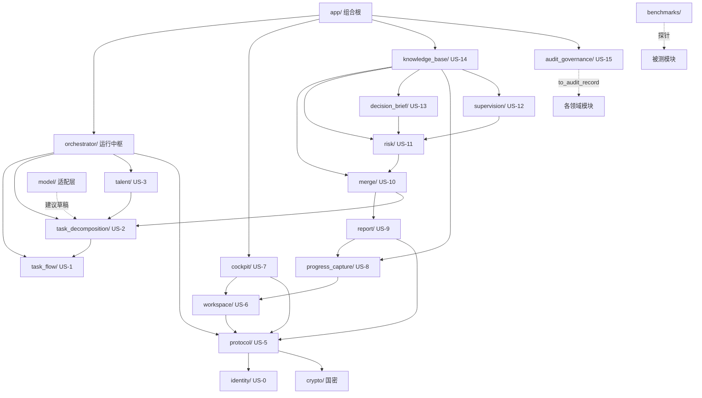

# 模块文档索引

`src/coevo` 每个包一份独立文档，统一采用以下模板（2026-08-06 细化）：

1. **定位** — 模块解决什么问题、对应哪个用户故事；
2. **职责边界** — in scope / out of scope；
3. **文件清单** — 逐文件关键类型/函数与职责；
4. **关键入口与数据流** — 调用链与数据流向；
5. **安全与不变量** — 失败关闭、审计、边界；
6. **测试覆盖** — 对应单元/集成/安全/e2e 测试文件；
7. **依赖与下游** — 上游依赖与消费者。

安全关键模块（cockpit/model/protocol/crypto/merge/identity/decision_brief/risk/
workspace/audit_governance 等）另含 **配置与错误语义** 小节，列出环境变量、
HTTP 语义与异常类型。

**测试运行**：每个模块文档的"测试覆盖"小节列出对应测试文件；单独验证某模块
可运行 `python -m unittest <测试文件模块路径>`（如 `python -m unittest
tests.unit.test_merge_engine`），全量门禁用 `make quality`（串行）。

## 模块依赖关系（数据流）

说明：`audit_governance` 与 `model` 为横切依赖（审计投影 / 模型适配），
`identity` 与 `crypto` 为协议/合并/简报提供证书与密码能力；完整需求到测试映射
见 [../../docs/traceability/requirements-test-matrix.md](../../docs/traceability/requirements-test-matrix.md)。

## 关键常量与闭集枚举索引

| 模块 | 闭集枚举 / 关键常量 |
|---|---|
| `task_flow` | `StandardStage`（六阶段）、`SourceKind`（LITERAL/DERIVED/DEFAULTED/OVERRIDDEN）、`DEFAULT_MAPPING_RULES`（27 条） |
| `task_decomposition` | `DependencyEdge.kind`（仅 `"fs"`）、交付物种类闭集（document/code/review/report/evidence） |
| `talent` | `SkillTag`、`OverloadReason`（AT_CAPACITY/OVER_CAPACITY/WINDOW_CONFLICT）、评分权重（技能 2.0/资质 1.0/窗口 1.5/0.5/负荷 1.0） |
| `orchestrator` | `AgentCapability`（11 类）、`AgentStatus`、`FailurePolicy`（RETRY/SKIP/ESCALATE_HUMAN）、`MVP_FIXED_CHAIN`（5 步） |
| `protocol` | `PACKAGE_TYPES`（10 类）、`AgentPackageFlags`（4 位）、`CIPHER_SUITE`、`ReplayOutcome`、`ImportStep`（7 步事务） |
| `workspace` | `_SAFE_ID` 字母表、`DEFAULT_QUARANTINE_ROOT`/`DEFAULT_WORKSPACE_ROOT` |
| `cockpit` | `CockpitRoute`（7 路由）、`CockpitResponseStatus`（6 状态）、`DEFAULT_ALLOWED_HOSTS`（环回白名单） |
| `progress_capture` | `EvidenceKind`（4 类，排除 FILE_MTIME_ONLY）、`ProgressItemKind`、`ProgressItemStatus` |
| `report` | `ReportStatus`（4 态）、`DEFAULT_REPORT_PACKAGE_TYPE`（RESULT_SUBMISSION） |
| `merge` | `MergeDecision`（ACCEPT/REJECT/HOLD/MANUAL）、`MERGEABLE_PACKAGE_TYPES`、`MISSING` 哨兵 |
| `risk` | `RiskKind`、`SourceKind`、可配置阈值（延期/沉默/证据不足） |
| `supervision` | `SUPERVISABLE_RISK_KINDS`、`COORDINATION_RECOMMENDED_KINDS`、`EscalationLevel`、`MeetingConclusionKind` |
| `decision_brief` | `BriefType`（STAGE/PERIODIC/RISK_TOPIC）、输入/模板硬上限常量 |
| `knowledge_base` | `KnowledgeSourceKind`、`ReusableTemplateKind`、`ReviewDecisionKind`、密级排序 |
| `audit_governance` | `InterceptionReason`（5 类）、`AuditEventSource`/`AuditEventResult`、查询 limit 硬上限 |
| `identity` | 角色码闭集（project_owner/project_member）、`HANDLE_PREFIX`、算法 OID 校验 |
| `crypto` | `ProviderScope`（MVP_PROTOTYPE/APPROVED_PRODUCT）、KEK 常量 |
| `model` | provider 闭集（offline/deepseek/local_openai）、`MAX_RESPONSE_BYTES`（4MiB） |
| `config` | `LOOPBACK_HOST`、`VALID_LOG_LEVELS` |

| 包 | 文档 | 故事 |
|---|---|---|
| `app/` | [app.md](app.md) | 应用组合根（演示流水线） |
| `audit_governance/` | [audit_governance.md](audit_governance.md) | US-15 安全审计 |
| `benchmarks/` | [benchmarks.md](benchmarks.md) | 可扩展性探针 |
| `cockpit/` | [cockpit.md](cockpit.md) | US-7 本地驾驶舱 |
| `crypto/` | [crypto.md](crypto.md) | 国密引擎适配 |
| `decision_brief/` | [decision_brief.md](decision_brief.md) | US-13 决策简报 |
| `identity/` | [identity.md](identity.md) | US-0 身份与信任 |
| `knowledge_base/` | [knowledge_base.md](knowledge_base.md) | US-14 知识沉淀 |
| `merge/` | [merge.md](merge.md) | US-10 状态合并 |
| `model/` | [model.md](model.md) | 模型适配层 |
| `orchestrator/` | [orchestrator.md](orchestrator.md) | US-4 运行中枢 |
| `progress_capture/` | [progress_capture.md](progress_capture.md) | US-8 进展采集 |
| `protocol/` | [protocol.md](protocol.md) | US-5 任务包协议 |
| `report/` | [report.md](report.md) | US-9 成果回传 |
| `risk/` | [risk.md](risk.md) | US-11 风险预警 |
| `supervision/` | [supervision.md](supervision.md) | US-12 督办协调 |
| `talent/` | [talent.md](talent.md) | US-3 团队组建 |
| `task_decomposition/` | [task_decomposition.md](task_decomposition.md) | US-2 任务分解 |
| `task_flow/` | [task_flow.md](task_flow.md) | US-1 流程理解 |
| `workspace/` | [workspace.md](workspace.md) | US-6 工作区 |
| 根级模块 | [root_modules.md](root_modules.md) | config/version/logging/records |

总览性质的单文件导览见 [../code-guide.md](../code-guide.md)。
