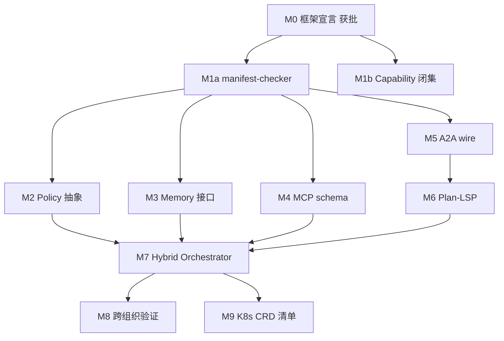

# 分布式具身智能体框架设计方案（v0.4.1）

> **版本**: v0.4.1 (2026-08-07)
> **状态**: 产品级草案。在 v0.4 基础上以业务负责人 + 产品经理视角批判性吸收审查结论（P0 硬伤 5 项 + P1 设计补强 5 项 + P2 落地增强 5 项，见 §19.6）；自评待独立复核后定稿。
> **变更追踪**: §19 修订说明;v0.3 保留为 `design-proposal-v0.3.md`。
> **vs v0.3 本质差异**: v0.3 是"技术 + 产品"二维;v0.4 加上"工程内部一致性"第三维度,重点消除 v0.3 评审中发现的 12 处内部不一致。

---

## 0. 文档定位与读者

| 章节 | 目标读者 | 推荐路径 |
| --- | --- | --- |
| §1 业务定位与价值主张 | 业务负责人 / 高层 | **必读** |
| §2 目标用户 + 典型场景 + 反方 FAQ | 产品 / 售前 | **必读** |
| §3 初心与指导原则 | 全员 | 必读 |
| §4 总体形态 | 架构师 | 必读 |
| §5 Agent Manifest 与 Checker 契约 | 框架扩展者 / M1 OWNER | **必读** |
| §6 六抽象(Task / Memory / Tool / Plan / Policy / Orchestrator) | 子模块 OWNER | 选读 |
| §7 协议平面 | 协议工程师 | 必读 |
| §8 编排与生命周期 | 编排 OWNER / 运维 | 必读 |
| §9 身份与权限 | 安全审计 | **必读** |
| §10 工作流 | 业务负责人 | 选读 |
| §11 可观测性与 SLA | 运维 | 必读 |
| §12 安全与合规不变量 | 安全审查 | **必读** |
| §13 威胁 × 防御矩阵 | 安全审查 | 必读 |
| §14 迁移路径与里程碑 | 项目经理 / OWNER | **必读** |
| §15 TCO / ROI / 商业化 | 项目经理 / 业务负责人 | **必读** |
| §16 与业界差异化 | 业务负责人 / 市场 | **必读** |
| §17 风险与已知限制 | 业务负责人 | 选读 |
| §18 评估与下一轮 | 全员 | 选读 |
| §19 修订说明 | 评审 / 业务 | **必读** |

---

## 1. 业务定位与价值主张

### 1.1 一句话 (30 字)

> **CTAF:受控场景下,可被法规审查、离线优先、零三方依赖的多智能体框架。**

### 1.2 完整一句话 (含边界)

> **Coevo Trusted Agent Framework (CTAF) v0.4**:以 Coevo MVP 已落地的国家密码学算法 (SM2/SM3/SM4) + `.agent` 加密包协议 + 全程审计链为基础,向受控场景(政府/军工/金融/科研)提供"**可被法规审查、离线优先、零三方依赖**"的分布式具身智能体编排框架。**它不**与通用云端 agent 平台在开放市场正面竞争;**它不**是 K8s CRD 的 reconcile loop;**它不**把"自主 Agent"作为默认模式。

### 1.3 三大价值主张

| # | 主张 | 验证 / 事实 |
| --- | --- | --- |
| **V1** 可被法规审查 | `.agent` v1.0 + 哈希链审计 + SM 国密;§9 四层 RBAC + §6.4.1 Plan 五项不变量 + §12 红线 L9..L19 |
| **V2** 离线优先 + 零三方依赖 | MVP 标准库 only;新增三方依赖需走主版本号升级 + 强制约束审查(§12.2 L15) |
| **V3** 受控的自主编排 | Anthropic 5 workflow 可选;Hybrid 模式默认;LLM 不得直接写主状态(§12.2 L11) |

### 1.4 三不主张

- 不与 AutoGen / LangGraph / CrewAI 在"通用云端"市场正面竞争(§16.5)
- 不替代 Kubernetes(CTA 是 discrete-execute + fail-up,不是 reconcile loop;§16.4)
- 不把"自主 Agent"作为 v0.4 默认模式(默认仍 Hybrid + 严格 ground truth)

---

## 2. 目标用户与典型场景

### 2.1 三类用户画像

| 画像 | 角色 | 痛点(具体数字) | CTA 解决 |
| --- | --- | --- | --- |
| **U1 受审计场景客户(政府/军工)** | 部委办公室 / 项目牵头处 | 跨部委流转典型 30 天→3 天;跨密级手工加密损耗 ≥ 20% 工作量 | `.agent` 加密包跨网;四次确认保证合规 |
| **U2 大型组织/科研院所** | 项目管理办公室 / 跨学科 PI | 跨学科合并 1 个项目平均 1 人月;知识沉淀分散在邮件/IM | US-0..US-15 全栈 + ProcessFlow 数据已结构化 |
| **U3 出海/监管严格** | 跨国办公 / 合规官 | 数据出域罚款风险;审计 ≥ 5 年 | 离线优先;全程审计;零三方依赖;哈希链自托管 |

### 2.2 三类 User Story

**场景 A:跨部委任务加密包跨网流转(U1)**
```
[立项机关] ── 加密 .agent 包 ──> [牵头省厅]
                                     ├─ 分解 → [承办局 1]
                                     ├─ 分解 → [承办局 2]
                                     └─ 合并 → 主版本更新 → 风险预警 → 决策简报
```

**场景 B:跨学科科研任务成果回传(U2)**
```
[科研 PI] -- 阶段成果 -- 受控合并 --> 主版本库
                 ↓                       ↑
            [QA 自动比对]       [财务确认 / 评审专家]
                 ↓                       ↑
            [简报生成]  <-- [风险早期预警]
```

**场景 C:跨国出海任务完全离线(U3)**
```
[总部] ── 加密 .agent ──> [海外子公司 A] ── 合并 ──> [总部]
                          [海外子公司 B] ── 合并 ──↑
```

### 2.3 反模式 (R1..R3)

- **R1**: 单用户单任务的极简场景 — IM/邮件即可,本框架过重
- **R2**: 超大规模(>1000 智能体)实时调度 — v0.4 不承诺,需 v0.5+
- **R3**: 纯无服务器 SaaS 化部署 — 与离线优先路线不符

### 2.4 反方意见回应 FAQ (A6 落地)

| # | 客户最常问 | 推荐回应 |
| --- | --- | --- |
| **Q1** | "国密开源 + LangGraph 拼一拼不是更便宜?" | "LangGraph 不带国密合规审计链;你们要花同样钱拼一个 audit_log + .agent envelope,那不就成了我们的 + 缺 §6.5 Policy" |
| **Q2** | "为什么不用 MCP 接现成 ecosystem?" | "MCP 路径已在 §7.2 给路径 B(v0.5 可选);v0.4 默认 stdlib only,零三方依赖(§12.2 L15)" |
| **Q3** | "K8s Operator 不就够了吗?" | "K8s 是 declarative + reconcile loop;CTA 是 discrete-execute + fail-up,见 §16.4 区别点表" |
| **Q4** | "ROI 比手工写低多少?" | "§15.3 给出 baseline 区间(最佳 +100% 效率,最坏 +20%);评估时需要你们给具体 baseline 项目" |
| **Q5** | "自主 Agent 安全吗?" | "v0.4 不默认自主 Agent;§6.4.1 五项不变量强制 ground truth;DynamicLLM 必须经 Hybrid 兜底" |
| **Q6** | "跨国子公司能直接对接吗?" | "可以;但 v0.4 不承诺跨互联网直接服务,需走政府专网/隔离网" |

---

## 3. 初心与指导原则

### 3.1 初心

把 MVP(US-0..US-15 + 固定链 A/B)抽象为可被多个第三方组织复用的框架层。

### 3.2 五大指导原则

| # | 原则 | 与 MVP 不变量的对应 |
| --- | --- | --- |
| **P1** | **失败关闭 + 显式错误码**(状态变更须人工确认) | AGENTS.md 强制边界 + §8.3 ESCALATED 回到 ACTIVE 的出口必须经 HELD 中转(§3.2 P1 落地点) |
| **P2** | 版本优先于时间戳 | `src/coevo/version.py` 0.2.0 |
| **P3** | 状态变更须人工确认 | 编排 HOLD/合并 HOLD/知识入库人工审核 + §8.3 出口 3 经 HELD |
| **P4** | 全程审计 + 哈希链 | `loop/audit-head.json` + `tool-audit.jsonl` + manifest-checker(M1)在 P4 闭集内 |
| **P5** | 不可信路径上不暴露密钥 | CNG `ProtectedKeyHandle` + Python 不见私钥 |

### 3.3 业界取舍(Anthropic 2024-12)

1. 优先简单,只在必要时增加复杂度
2. 框架只是脚手架:不要添加遮蔽底层语义的抽象层
3. 信任要可验证:所有高风险动作必须有 ground truth 与人工确认点

---

## 4. 总体形态:两层 + 四域 + 两切面

```text
   ╔════════════════════════════════════════════════════════════╗
   ║             Protocol & Security Layer (P1)                ║
   ║  · 身份         · 协议 (.agent v1.0) · 审计                  ║
   ║  · 密码学 SM2/3/4· MCP 工具描述层(仅 schema)                 ║
   ╠════════════════════════════════════════════════════════════╣
   ║            Orchestration Layer (P3)                        ║
   ║  · 编排 Engine(可注入) · State Machine · 审计事件流        ║
   ║  · A2A 子层(走 .agent v1.0 加密承载)                        ║
   ╠════════════════════════════════════════════════════════════╣
   │              Execution Domain (4 域)                      │
   └──────────────────────────────────────────────────────────┘
   ≋≋≋≋≋  Trust Surface (身份/签名/密钥)   ≋≋≋≋≋
   ≋≋≋≋≋  Audit Surface (记录/摘要/可观测) ≋≋≋≋≋
```

| 层 | 职责 | MVP 落位 |
| --- | --- | --- |
| **P1: Protocol & Security** | 身份、加密、信封、审计 | `crypto/` `protocol/` `identity/` `audit_governance/` |
| **P3: Orchestration** | 事件总线、状态机、人机协作、A2A | `orchestrator/` `supervision/` `decision_brief/` |

**四域**:执行域(17 个子包)、协议域、密码学域、协作域(拟新增)
**两切面**:Trust Surface / Audit Surface

---

## 5. Agent Manifest

### 5.1 Manifest 草案 (v0.4.1 增量)

```yaml
apiVersion: coevo.framework/v1
kind: Agent
metadata:
  agent_id: "task_decomposition.basic"
  display_name: "任务分解智能体(基础版)"
  semantic_version: "0.2.0"
  spec_hash: "<sha256(规范化字节, 排除 spec_hash/signature 自指字段)>"  # 规范化规则见 §7.3.2
spec:
  capability: "TASK_DECOMPOSITION"      # §5.2 闭集单值
  triggers:
    - kind: orchestration.event
      event_type: "REQUEST_TASK_DECOMPOSITION"
  inputs_schema:  "coevo://schemas/project_baseline/v1.json"
  outputs_schema: "coevo://schemas/project_baseline/v1.json"
  tools:
    allow: [ "coevo://tools/dependency_graph.cycle_check" ]
    deny:  [ "*shell*", "*filesystem*" ]
  memory:
    episodic_retention_days: 30
    semantic: false
  requires_human_confirmation: true
  confirmation_role: "project_owner"
policy_profile: "INTERACTIVE"             # v0.4 新增: 仅引用名
policy_version: "1.0"                     # v0.4.1 新增: 绑定 Profile 语义版本,防跨部署点漂移
policy_ref:                               # §7.3.2 三段绑定
  spec_hash: "<sha256(规范化 manifest 字节, 排除自指字段)>"
  signer_cert_fingerprint: "<sha256(证书 DER)>"
security:
  crypto_scope: "TASK_AGENT"
audit:
  redact_in_audit:
    - "model_reasoning"
    - "user_input"
```

**v0.4 改动**:
- Manifest 内**不**包含任何时间/重试/Plan 深度等数值字段(统一去 §6.5 Policy 取)
- `policy_profile` 升级为 Manifest 顶层字段
- `policy_ref` 移出 spec,作为顶层锚定(对应 §7.3.2 三段)

**v0.4.1 修复**:
- `spec_hash` 规范化排除自指字段（`spec_hash` / `policy_ref.signature`），避免"哈希包含自身"（F5，见 §19.6）
- 新增 `policy_version`，把 Profile 名称绑定到语义版本，防止跨部署点同名 Profile 漂移（F7）
- 其余 P0/P1/P2 修复清单见 §19.6

### 5.2 capability 闭集 (与 MVP AgentCapability 同步)

> 实现落位：`src/coevo/framework/capability.py`（M1b / US-16-AC-3，
> 2026-08-08）。MVP 名称映射 `AgentCapability`（新增 `knowledge_ingest`），
> CRYPTO_PROXY 限 `approved-product`，PLANNER..HUMAN_GATE 为框架抽象能力。

```
TASK_FLOW_UNDERSTANDING  TASK_DECOMPOSITION       TEAM_RECOMMENDATION
TASK_PACKAGE_BUILD       RISK_ANALYSIS             DECISION_BRIEF
KNOWLEDGE_INGEST         SUPERVISION               AUDIT_INTERCEPT
PROGRESS_CAPTURE         REPORT_BUILD              MERGE_ENGINE
CRYPTO_PROXY (限 APPROVED_PRODUCT)
PLANNER  ROUTER  AGGREGATOR  EVALUATOR  OPTIMIZER  HUMAN_GATE  (抽象工具)
```

### 5.3 Manifest Checker 输入输出契约 (A4 落地)

#### 5.3.1 输入

```python
@dataclass(frozen=True)
class ManifestCheckInput:
    manifest_bytes: bytes         # 待校验 YAML 规范化字节
    site_policy: Policy          # 部署点的 Policy(默认从环境取)
    trusted_anchor_pubkey: bytes # 部署点公钥锚
    now: str                     # ISO-8601 UTC 'Z'
```

#### 5.3.2 输出

```python
@dataclass(frozen=True)
class ManifestCheckResult:
    accepted: bool
    validated_manifest: AgentManifest | None
    spec_hash: str                            # SHA-256(manifest_bytes)
    signed_at: str
    failure_reason: str | None                # 参照 §13 矩阵红线
```

#### 5.3.3 调用契约

```
[agent owner] → manifest_checker.check(input)
                  → 成功: 注册到 agent_registry
                  → 失败: 返回 failure_reason, 不注册
```

**M1a 6 项向后兼容测试**(v0.2 起固化 5 项,v0.4.1 新增 T6):

| 序号 | 测试 | 作用 |
| --- | --- | --- |
| T1 | test_manifest_minimal_valid | 最小合法 Manifest 通过 |
| T2 | test_manifest_unknown_capability_rejected | §5.2 闭集外被拒 |
| T3 | test_manifest_requires_human_confirmation_default | 默认 true 与 OrchestrationStep 对齐 |
| T4 | test_manifest_crypto_scope_enum | crypto_scope 必须 ProviderScope 闭集 |
| T5 | test_manifest_redact_in_audit_subset_of_to_audit | Manifest redact ⊆ to_audit_record |
| T6 | test_agent_wire_v1_unchanged | .agent v1.0 wire 字节级回归（承诺"wire 不动"必须有测试钉住） |

#### 5.3.4 manifest-checker 与 P4 / L17 关系

- T1..T6 形成 M1a 验收
- 新文件 `src/coevo/framework/manifest_checker.py` 必须经 §12.2 L17 `test_module_docs.py` 守卫
- 任何 manifest-checker 改动必须同步更新 §5.3

---

## 6. 六抽象

> **v0.4 关键改动**: Plan 仅保留 DAG + policy_profile,所有数值字段统一从 Policy 拿 (A1 落地)。

### 6.0 抽象清单与对应表

| 抽象 | Anthropic 等价 | MVP 落位 |
| --- | --- | --- |
| Task | Chaining 的 Step | .agent EnvelopeHeader + payload |
| Memory | Agent 上下文 | progress_capture/ + knowledge_base/ |
| Tool | Function calling | cockpit/wps.py + crypto/ |
| Plan | Orchestrator-Workers 的产物 | OrchestrationChain.steps |
| Policy | v0.3 一等公民 | §12 L9..L16 累积 |
| Orchestrator | 状态机/Orchestrator-Workers | Orchestrator + _real_chain.py |

### 6.1 抽象 A: Task

```text
Task = {
  protocol_version: "1.0",
  package_id:       <uuid>,                  # = .agent package_id
  task_type:        <closed_enum>,           # §5.2 闭集
  trace_id:         <uuid>,                  # _make_trace_id(event_id, step_index, seed)
  parent_task_id:   <uuid|None>,
  project_id:       <safe_id>,
  sender_cert_id:   <safe_id>,
  recipient_cert_id:<safe_id>,
  sequence_no:      <int>,                   # 包级重放 = EnvelopeHeader.sequence_no
  business_correlation_key:  <string>,       # 业务去重
  business_correlation_scope: "project_id|workflow_id",
  inputs:  <inputs_schema 校验>,
  outputs: <outputs_schema 校验>,
  requires_human_confirmation: <bool>,
  envelope_signature: <SM2 sig over canonical bytes>,
}
```

### 6.2 抽象 B: Memory

> 实现落位：`src/coevo/framework/memory.py`（M3 / US-16-AC-4，2026-08-08）。
> 适配映射见 `docs/framework/memory-interface.md`。

| 类别 | MVP 落位 | 写入约束 |
| --- | --- | --- |
| **Episodic** | progress_capture/ | to_audit_record 必填 |
| **Semantic** | knowledge_base/ | ReviewDecisionKind 审批 |

**不变约束**: 落盘前经 `RedactedIdentity`,明文 PII 不进 DB。

### 6.3 抽象 C: Tool

> 实现落位：`src/coevo/framework/tools.py`（M4 / US-16-AC-5，2026-08-08）。
> 适配映射见 `docs/framework/tool-registry.md`。

```yaml
kind: Tool
metadata:
  tool_id: "coevo://tools/dependency_graph.cycle_check"
  tool_version: "1.0.0"               # P2 必填
  display_name: "依赖环检测"
  side_effects: "pure"                # pure | idempotent | external
  requires_consent: true
  timeout_sec: 5
  size_in_bytes_max: 4096
spec:
  input_schema_ref:   "coevo://schemas/tool/cycle_check.in.json"
  output_schema_ref:  "coevo://schemas/tool/cycle_check.out.json"
security:
  crypto_scope: "TASK_AGENT"          # 与 §9 L4 Scope 强绑定
  audit_required: true
```

### 6.4 抽象 D: Plan (v0.4 重写, A1 落地)

> v0.3 误把数值字段塞进 Plan。v0.4 修正: Plan 只描述"DAG 结构 + 引用哪个 Policy 模板",所有数值从 Policy 拿。

```text
Plan = {
  plan_id:           <fingerprint>,                # SHA-256(规范化 bytes)
  plan_version:      <semver>,
  policy_profile:    <closed_enum>,                # INTERACTIVE/BATCH/AUDIT_ONLY/EMERGENCY
  nodes:             <tuple[PlanNode, ...]>,
  edges:             <tuple[PlanEdge, ...]>,
  # v0.4 移除: max_plan_depth / max_runtime_sec / max_recover_attempts
  # → 全部从 Policy 拿 (§6.5)
}

PlanNode = {
  node_id:        <fingerprint>,
  kind:           AGENT | TOOL | HUMAN_GATE,       # §6.4.1 不变量 2 闭集
  agent_capability: <closed_enum> if kind==AGENT, # §5.2 闭集
  tool_ref:        <tool_id>       if kind==TOOL,
  tool_args:       <mapping>       if kind==TOOL,
  human_gate_reason: <string>      if kind==HUMAN_GATE,
  requires_human_confirmation:    <bool>,
  confirmation_role: "project_owner" | "project_member",
}
```

#### 6.4.1 Plan 五项不变量 (v0.4 加强, A2 落地)

| 不变量 | 构造期 (L1) | 注册期 (L2) | dispatch 期 (L3) |
| --- | --- | --- | --- |
| **环检测** | cyclic_check(显式栈 DFS);MVP `cycle_in_components` | 再次校验防构造后被改 | n/a |
| **节点类型闭集** | kind ∈ {AGENT,TOOL,HUMAN_GATE};AGENT 的 capability ∈ §5.2 | registry 校验闭集 | dispatch 时再次 |
| **可哈希** | Plan 规范化 SHA-256 → 进 spec_hash | 进 AuditEvent.fingerprint | 引用记录 |
| **Plan 节点不跨 L4 Scope** | LLM 写 Tool 节点时只引 ≤ Plan.policy_profile scope | registry 拒绝越级(明示错误) | provider 变化强重验 RBAC |
| **跨域 Plan 必过四层 RBAC** | 构造期 L2 校验 actor | registry 校验 P3 | dispatch 时再跑 §9 |

> §12.2 L9 落地点 = 注册期的 "Tool 节点不跨 L4 Scope" + dispatch 期 provider 变化重验。

#### 6.4.2 Plan 与 Policy 字段归属表 (A1 明确化)

| 字段 | 归属 | 谁设 |
| --- | --- | --- |
| policy_profile 名称 | Plan (结构引用) | workflow owner |
| 具体数值 (timeout 等) | Policy (数值实例) | agent / workflow owner |
| nodes/edges/kind | Plan (结构) | plan writer (LLM 或人) |
| requires_human_confirmation | PlanNode (节点语义) | plan writer |
| audit_redaction 列表 | Policy (实例) | agent owner |

> Plan 内**不**允许出现策略归属数值键（timeout / retry / depth / attempts 等，v0.4.1 起按白名单口径执行，见 §12.2 L18）；`PlanNode.tool_args` 等数据字段按 schema 允许；违规字段由 manifest-checker + validate_plan 双闸拒收。

### 6.5 抽象 E: Policy

```text
Policy = {
  policy_id:     <fingerprint>,
  policy_version: <semver>,
  profile:         "INTERACTIVE" | "BATCH" | "AUDIT_ONLY" | "EMERGENCY",

  timeout_profile:
    dispatch_timeout_sec:   30,
    plan_total_timeout_sec:  600,
    consent_timeout_sec:    600,

  retry_profile:
    max_recover_attempts:    3,        # 红线 L16
    max_router_retries:       3,
    recover_backoff_sec:     [1, 5, 15],

  consent:
    requires_human_confirmation: true,
    default_role: "project_owner",

  audit_redaction: ["model_reasoning", "user_input"],

  ground_truth_required: ["plan_hashability", "dag_acyclic", "tool_scope_within_l4"],
}
```

**默认 Profile 模板 (B6 落地)**:

| Profile | dispatch_timeout | plan_total_timeout | max_recover_attempts | requires_human_confirmation |
| --- | --- | --- | --- | --- |
| INTERACTIVE | 30s | 600s | 3 | true |
| BATCH | 120s | 3600s | 2 | false (仅关键节点) |
| AUDIT_ONLY | 60s | 900s | 3 | true (每个节点都要) |
| EMERGENCY | 15s | 60s | 1 | false (强制审计 + 事后 30 分钟内人工确认; 本地告警) |

**v0.4.1 修正（业务负责人 + 产品经理决策）**:
- 所有 Profile 的 `max_recover_attempts` ≤ 3，对齐 L16 与 §8.3 "recover 计数 ≥ 3 → ESCALATED"（AUDIT_ONLY 由 5 改 3）。
- EMERGENCY 重定义为 fail-fast：1 次重试、总时限 60s、不在线等待人工（消除 300s 总时限 < consent 600s 的时序矛盾），改为强制审计 + 事后 30 分钟内人工确认；移除 PagerDuty 外部依赖（离线优先，外部通知网关如需接入须另行依赖审批）。

### 6.6 抽象 F: Orchestrator (v0.4 修订, A9 落地)

```python
class OrchestrationEngine(Protocol):
    def plan(self, task: Task, policy: Policy) -> Plan: ...
    def validate_plan(self, plan: Plan, policy: Policy) -> ValidationResult: ...   # v0.4 新增
    def dispatch(self, task: Task, plan: Plan) -> OrchestrationOutcome: ...
    def confirm(self, outcome: OrchestrationOutcome, by: str) -> OrchestrationOutcome: ...
    def recover(self, task_id: str) -> OrchestrationOutcome: ...
```

**v0.4 关键修订**: validate_plan 是 dispatch 的前置必调(不能跳过)。

| 实现 | ground truth | fallback |
| --- | --- | --- |
| StateMachine | 静态 chain | 终止 + audit RECOVER |
| DynamicLLM | §6.4.1 五项不变量 | 回退 StateMachine |
| Hybrid | LLM 提议只能覆盖非 HOLD 节点 | LLM 提议失败 → 回退 StateMachine |

### 6.7 六抽象与 MVP 落位总览

| 抽象 | MVP 落位 | 可替换度 | 框架改造点 |
| --- | --- | --- | --- |
| Task | .agent EnvelopeHeader | **不动 wire** | payload 内 namespace |
| Memory | progress_capture/ + knowledge_base/ | 领域接口一致 | 加 Episodic/Semantic 接口 |
| Tool | cockpit/wps.py + crypto/ | 同进程注册表 | MCP-style 注册表(仅 schema) |
| Plan | OrchestrationChain.steps | 待 Manifest 收敛 | Plan-LSP |
| Policy (v0.3 新增) | 由 §12 L9..L16 累积 | 自然抽象 | 抽出"策略模板" + 4 个默认 profile |
| Orchestrator | Orchestrator + _real_chain | 部分 | **可注入接口 + 显式 Policy + validate_plan 前置 (v0.4)** |

---

## 7. 协议平面

### 7.1 `.agent` 协议 v1.0 (不动)

```
[fixed_header][envelope_json][sm2_wrapped_key][sm4_gcm_payload][gcm_tag]
```

- 信封上限 `ENVELOPE_MAX_BYTES = 64 KiB`
- payload 内放 Task + Manifest + Signature
- v1.0 不变; wire 改动必须主版本号升级

### 7.2 MCP 兼容层

```
本地 Tool ←→ 本框架 Tool 注册表(JSON 描述) ←→ 远程 MCP 服务
```

- 路径 A (v0.4 默认): 仅 schema 对齐; 零三方依赖
- 路径 B (v0.5 可选): 允许引入 MCP SDK,需 docs/dependencies 申请 + 主版本号升级 + 强制约束审查
- 远端 MCP `tools/call` 必须在 Coevo 安全壳内执行

### 7.3 A2A (Agent-to-Agent)

#### 7.3.1 A2A 字段映射

| A2A 字段 | 复用 .agent 字段 | 说明 |
| --- | --- | --- |
| task_id | EnvelopeHeader.package_id | UUID |
| trace_id | OrchestrationTrace.trace_id | SHA-256 |
| sender_cert_id | EnvelopeHeader.sender_cert_id | 闭集 SAFE_ID |
| recipient_cert_id | EnvelopeHeader.recipient_cert_id | 闭集 SAFE_ID |
| sequence_no | EnvelopeHeader.sequence_no | 包级重放 |
| business_correlation_key | Task.business_correlation_key | 业务去重 |
| purpose | payload.task_type | §5.2 capability 闭集 |
| **policy_ref** | **§7.3.2 三段绑定** | sender Manifest 锚定 |
| envelope_signature | manifest 签名 | SM3 + SM2 |

#### 7.3.2 policy_ref 结构

```json
{
  "policy_ref": {
    "spec_hash": "<sha256(规范化 manifest 字节; 排除 spec_hash/signature 自指字段, 规则同 .agent envelope)>",
    "signer_cert_fingerprint": "<sha256(证书 DER)>",
    "signature": "<SM2 sig over (spec_hash | signer_cert_fingerprint)>"
  }
}
```

或 URI 形式 `policy_ref = "coevo://manifests/{sender_cert_id}/{spec_hash}"`

#### 7.3.3 policy_ref 接收方验证时序 (B7 落地)

```
[1] 取 envelope.sender_cert_id,从本地证书链查 sender_cert 的 DER
[2] 计算 (signer_cert_fingerprint == sha256(本地查到的 DER))
    失败 → reject(冒名)
[3] 从 envelope 内 payload 取 manifest_bytes,计算 sha256(manifest_bytes)
    与 policy_ref.spec_hash 比较
    不等 → reject(manifest 被替换)
[4] 用第 1 步证书链查得的 sender 证书公钥验 SM2 signature（policy_ref 不含公钥字段, 公钥来源 = 证书链）
    失败 → reject(签名伪造)
[5] 通过 → record 是合法 policy_ref,继续 A2A 业务校验
```

#### 7.3.4 边界声明

1. A2A 消息必须由 .agent v1.0 加密包承载
2. envelope > 64 KiB 时: 业务数据 → RESULT_SUBMISSION 包; 元数据 → A2A envelope
3. 放宽 envelope 上限必须主版本号升级 (v1.1+)
4. 跨组织证书引导/吊销（v0.4.1 补充）：信任采用显式信任列表（预置证书指纹）建立;吊销通过离线包交换的吊销清单处理;不引入 PKI 联邦（§17 保留）。

### 7.4 审计事件格式 (沿用 MVP)

`loop/tool-audit.jsonl` + `audit-head.{json,p7s}` + `loop/DECISIONS.md`。
新框架事件必须用 AuditEvent / SecurityAuditFacade 投射。

---

## 8. 编排平面与生命周期

### 8.1 三段式生命周期 (保留 MVP)

```
DISPATCH → EVAL (auto) → CONFIRM (human, optional)
        ↘         ↘
        ESCALATE_HUMAN / ABORT_AND_RECORD
```

### 8.2 强制运行时约束 (沿用 v0.3)

| 约束 | 默认 | 对应风险 | 适用场景 |
| --- | --- | --- | --- |
| dispatch_timeout_sec | ≤ 30s | 单次 dispatch 卡死 | 单次 dispatch |
| plan_total_timeout_sec | ≤ 600s | Plan 卡死 | 长链路 Plan |
| consent_timeout_sec | ≤ 600s | 人工确认挂死 | HELD 态 |
| max_plan_depth | ≤ 4 | Orchestrator 无限展开 | Plan-DAG |
| max_recover_attempts | ≤ 3 | RECOVERED 循环 | 编排器 |
| dangerous_actions_default | deny | LLM 自动批准 | 全局 |

### 8.3 八态生命周期 (v0.4 修订, A10 落地)

> v0.3 出口 3 "→ ACTIVE with new policy" 给读者错觉是自动恢复。
> v0.4 改回"必须经 HELD 等人工确认后再 ACTIVE"。

| 态 | 进入 | 退出 |
| --- | --- | --- |
| REGISTERED | Manifest 通过 manifest-checker | start() |
| INSTANTIATED | start() 成功 | dispatch(task) |
| ACTIVE | dispatch | confirm / timeout / recover |
| HELD | requires_human_confirmation=true | confirm / reject (**§3.2 P1 落地点**) |
| RECOVERED | recover() 调用; 最多 3 次 | 完成 / 升级 ESCALATED |
| ESCALATED | recover 计数 ≥ 3 | **三种人工确认出口 (见下; 回到 ACTIVE 必须经 HELD)** |
| RETIRED | retire() | 留 tombstone |
| REVOKED | revoke() | 仅保留审计 |

**ESCALATED 三种出口 (v0.4 修订)**:

1. → **RETIRED** (最常见): 任务终止
2. → **HELD with new policy**: 补丁恢复 (Policy 模板可换)
3. → **HELD 重新调度** (v0.4 修订: 不再是 "→ ACTIVE"): 补丁恢复后, **人工确认后才再次 dispatch**

对应审计事件: `escalated_retired` / `escalated_held_new_policy` / `escalated_held_for_redispatch` (v0.4 新增)。

### 8.4 validate_plan 调用契约 (A9 落地)

```
[Orchestrator.dispatch(task, plan)]
  → self.validate_plan(plan, plan.policy_profile)
       → 失败 → return OrchestrationOutcome(REJECTED, "validate_plan failed")
  → 通过 → 继续 dispatch(...)
```

`validate_plan` 必须:
1. 跑 §6.4.1 五项不变量 (环/闭集/可哈希/L4 Scope 不越界/四层 RBAC)
2. 校验 Plan 内**无任何数值字段** (L18)
3. 返回 `ValidationResult(accepted, plan_hash, plan.policy_profile, validated_at)`

---

## 9. 身份与权限:四层 RBAC

| 层 | 决议 | 作用 | MVP 实体 | 校验时机 | 缓存策略 | 失效传播 |
| --- | --- | --- | --- | --- | --- | --- |
| **L1 Subject** | who | 人/组织/终端 | Actor | 每次 dispatch | 无 | cert 失效即时 |
| **L2 Role** | what kind | 项目内角色 | ProjectRoleBinding | 每次 dispatch | 项目期 | 项目结束即失效 |
| **L3 Capability** | what action | 智能体被允许动作 | AgentCapability 闭集 + Tool.crypto_scope | Manifest 校验时 | 与 Manifest 绑定 | Manifest 失效即失效 |
| **L4 Scope** | what crypto | 密码学操作范围 | CryptoProvider.ProviderScope | 每次 sign/seal | 无 | scope 切换即重签 |

**核心不变约束**: 任何 dispatch 必须四层全通过。

**ESCALATED → ACTIVE 路径 (v0.4)**: 必须重新校验四层; §3.2 P1 要求必须人工确认,故 ESCALATED → ACTIVE 不允许直跳, 必须经 HELD 中转。

---

## 10. 智能体协作的三种工作流

### 10.1 Plan-then-Decompose (= Prompt Chaining + Orchestrator)

```
USER → Orchestrator(Plan + Policy) → validate_plan → SpecialistAgent → Gate(Human Confirm)
                ↓
        KnowledgeBase / RiskAnalyzer
```

### 10.2 Specialist Routing (= Routing)

```
USER → RouterAgent(classify) → { PlannerAgent | DecoAgent | ReviewerAgent | RiskAgent }
```

**fallback 规则**:
- Router 首跑必须先过 `outputs_schema` 验证
- 失败等价于 `plan_fallback = STATE_MACHINE_RULE_BASED`
- LLM 重试上限 3 次; 3 次失败转回 HumanGate

### 10.3 Multi-Specialist Consensus (= Parallelization + Evaluator-Optimizer)

```
            ┌── Specialist A ──┐
USER → Split┤── Specialist B ──├→ Aggregator → Evaluator → Optimizer → Gate(Human)
            └── Specialist C ──┘              ↑__________________|
```

MVP 等价: `RiskAnalyzer.analyze_after_merge` + `DecisionBriefService`。

---

## 11. 可观测性与 SLA

### 11.1 三层指标 (RED + USE) — v0.4 加"业务涵义"列 (B10 落地)

| 层 | 指标 | 业务涵义 (v0.4 新) | 采集者 | 暴露面 |
| --- | --- | --- | --- | --- |
| **Rate** | dispatch_qps / confirm_qps / recover_qps | "系统一秒最多处理多少任务" / "人工确认吞吐" / "失败恢复吞吐" | 编排 facade 计时器 | audit-stream 派生 |
| **Errors** | rejected / held / expired / escalated count | "被拦截(合规底线)" / "等待人工" / "过期" / "升级项目经理" | InterceptionDecision | /api/health |
| **Duration** | dispatch_latency / confirm_latency | "客户感知延迟" / "人工响应延迟" | 编排 facade 计时器 | /api/health (p95/p50/max) |

- 采样: 全请求采样 → EWMA (权重 0.1)
- 反压: audit-stream 单连接背压阈值 100 events/s

### 11.2 模型 SLA (独立通路)

- 单次推理超时 ≤ 30s
- 推理失败重试 1 次; 2 次失败转 fallback
- Token 配额与成本监控走独立面板

### 11.3 健康端点

| 端点 | 用途 | 已实现 |
| --- | --- | --- |
| /healthz | 进程存活 + Service identity | AVAIL-2 |
| /api/health | 已认证只读状态 | METRICS-1 |
| /api/audit-stream | 实时审计流订阅 | STREAM-PERSIST-1 |

---

## 12. 安全与合规不变量

### 12.1 MVP 现有红线 (8 条保留)

| 类别 | 不变量 | 落位 |
| --- | --- | --- |
| 身份 | 私钥字节不进 Python 进程 | identity/private_keys.py + CngKekStore |
| 任务包 | 篡改/过期/重放/错接收人 4 类必须 100% 拦截 | SecurityAuditFacade.evaluate_interception |
| 合并 | 收据签名 + 快照冻结; 版本一致 | merge/receipt.py |
| 审计 | 哈希链 + 签名检查点 | audit_governance/stream_store.py |
| 驾驶舱 | 环回绑定 + CSRF + 静态白名单 | cockpit/server.py |
| 路径 | 重解析点拒绝、穿越守卫 | workspace/paths.py |
| 工具链 | SHA-256 + 大小锁; 运行时不联网 | scripts/ci-restore-toolchain.ps1 |
| 密码学 | SM2/SM3/SM4 全链路 | crypto/contract.py |

### 12.2 框架新增红线 (L9..L19, 11 条)

| # | 红线 | 落位 |
| --- | --- | --- |
| **L9** | Plan-DAG 节点引用 scoped Tool 必须经 L4 Scope 强制校验;Plan-Generator 不得自创新 scope | §6.4.1 L2/L3、§6.6 validate_plan |
| **L10** | A2A 消息不得明文传输 (仅 .agent v1.0) | §7.3.4 |
| **L11** | Plan-Generator 不得直接修改主版本 (只能 Plan + 候选 base_revision) | US-10 AC-3 |
| **L12** | Memory 写入必须经 RedactedIdentity | §6.2 |
| **L13** | 跨域 Plan/Task 必须四层 RBAC 全通过 | §6.4.1 L5、§9 |
| **L14** | 审计链不得任意格式扩展, 只能追加 | audit_governance/stream_store.py |
| **L15** | 禁止新增 mcp/httpx/aiohttp/openai 等三方运行期依赖（标准库如 asyncio 不在此列） | §7.2 |
| **L16** | max_recover_attempts ≤ 3, 超出强制 ESCALATE_HUMAN | §8.2 |
| **L17** | src/coevo/framework/ 与 docs/framework/ 覆盖度必须经 test_module_docs.py | §5.3.4、§14 |
| **L18 (v0.4 新, v0.4.1 白名单口径)** | Plan 内**不允许**出现策略归属数值键 (max_plan_depth / max_runtime_sec / max_recover_attempts / timeout 等);数值统一从 Policy 取;PlanNode.tool_args 等数据字段按 schema 允许 | manifest-checker + validate_plan |
| **L19 (v0.4 新, v0.4.1 语义修正)** | ESCALATED 出口中**回到 ACTIVE 的任何路径必须经 HELD 中转**;RETIRED 可直接退出;不可直跳 ACTIVE | §8.3 |

### 12.3 与 mandatory-technical-constraints 等价关系

> 红线 L9..L19 不冲突 `docs/constraints/mandatory-technical-constraints.md`。冲突时以约束文件为准。

---

## 13. 威胁 × 防御矩阵

> v0.3 13 行;v0.4 新增/加强 4 行（policy_ref 冒名、Plan 节点越 L4 Scope、Plan 数值错位、ESCALATED 直跳），共 16 行

| 威胁 / 防御层 | L1 Subject | L2 Role | L3 Capability | L4 Scope | Trust Surface | Audit Surface |
| --- | --- | --- | --- | --- | --- | --- |
| 冒名顶替 | 证书指纹链 | Binding 引用 | 闭集枚举 | scope 名册 | CNG handle | policy_ref 签名 |
| **policy_ref 冒名 (v0.4 加强)** | n/a | n/a | n/a | n/a | §7.3.3 五步验证时序 | spec_hash 比对 |
| 重放 / 重复 | n/a | n/a | n/a | n/a | nonce + sequence_no | hash chain |
| 业务级去重 | n/a | n/a | n/a | n/a | business_correlation_key | dedup_key |
| 过期 / 失效 | cert validity | binding 窗口 | step TTL | scope 时间窗 | signature verify | retention days |
| 错误接收人 | n/a | n/a | capability ↔ cert | scope 拒绝 | recipient check | 拦截记录 |
| LLM 失控 | n/a | n/a | capability 闭集 | scope 拒绝 | max_plan_depth / dispatch_timeout | Plan hash audit |
| LLM 提议影响主版本 | n/a | n/a | Plan 不得改 version | n/a | base_revision 校验 | merge engine |
| **Plan 节点越 L4 Scope (v0.4 明确)** | n/a | n/a | scope 闭集 | §6.4.1 L4 校验 | validate_plan | spec_hash 比对 |
| **Plan 数值错位 (v0.4 新增 L18)** | n/a | n/a | n/a | n/a | manifest-checker | error event |
| 跨域 PII 泄露 | redaction | n/a | memory.semantic: bool | scope 拒绝 | RedactedIdentity | redact_in_audit |
| 审计链篡改 | n/a | n/a | n/a | n/a | n/a | 哈希链 + 签名检查点 |
| Tool 越权 | n/a | n/a | allowlist | scope 拒绝 | requires_consent | audit_required |
| ESCALATED 重启越权 | n/a | 重新校验 | 重新校验 | 重新校验 | n/a | 重新校验 audit |
| **ESCALATED → ACTIVE 直跳 (v0.4 L19)** | n/a | n/a | n/a | n/a | 状态机强制经 HELD | 状态审计 |
| 代码注释覆盖度漂移 | n/a | n/a | n/a | n/a | n/a | test_module_docs.py (L17) |

---

## 14. 迁移路径与里程碑

### 14.1 四阶段渐进

| 阶段 | 目标 | 验收口径 | 不破坏现状 |
| --- | --- | --- | --- |
| F0 (基线) | MVP 验收通过 | 强基线绿 + 弱基线 ≥95% | — |
| F1 (声明) | manifest-checker + Policy + AgentSpec 抽象 | T1..T6 + 3 项 Policy test | wire 不动 |
| F2 (适配) | MCP 路径 A + A2A wire 0.1 | 三个 mock agent 走通 | 仅新增模块 |
| F3 (闭环) | Plan-as-a-Service + Hybrid Orchestrator | e2e 闭环 | 仅扩展 orchestrator |

### 14.2 里程碑 (v0.4 重估, A3 + A4 落地)

| 节点 | 内容 | 时间盒 | 进度锚 | 风险点 | 延长一倍触发 |
| --- | --- | --- | --- | --- | --- |
| **M0** | 框架宣言 (v0.4 获批) | T+0 | — | 业务负责人拍板 | > 2 周未批 |
| **M1a** | manifest-checker + 6 项测试（含 T6 wire 回归） | **2 周** | 第 1 周末 T1/T2 通过; 第 2 周末 T3..T6 | Manifest schema 漂移 | 受影响字段 > 5 个 |
| **M1b** | Capability 闭集收敛 + 文档 | **2 周** | 第 1 周末 PR; 第 2 周末测试 | 与 _real_chain.py 不一致 | 闭集冲突 > 3 处 |
| **M2** | Policy 抽象 + 4 profile + 三层 scope | **4 周** | 第 2 周末 INTERACTIVE/BATCH; 第 3 周末 闭集测试; 第 4 周末 validate_plan | 与 manifest-checker 协调 | 需重写 PolicyLoader |
| **M3** | EpisodicMemory / SemanticMemory | **6 周** | 第 4 周接口 PR; 第 5 周 demo; 第 6 周长寿命回归 | 与 progress_capture 桥接 | adapter > 3 处 |
| **M4** | MCP schema 路径 A | **8 周** | 第 4 周转换 PR; 第 6 周双向 99% 一致 | 一致性 < 99% | 降级单向 schema |
| **M5** | A2A wire 0.1 + policy_ref 三段 | **6 周** | 第 3 周三段 PR; 第 4 周验证时序 | 接收方慢 > 500ms | 缓存 manifest hash |
| **M6** | Plan-LSP (可哈希 DAG) + 五不变量 | **10 周** | 第 5 周序列化; 第 7 周不变量; 第 9 周 L18 检查 | DAG > 100ms/节点 | 拆分 chunks |
| **M7** | Hybrid Orchestrator + validate_plan + 三层 scope | **12 周** | 第 6 周 StateMachine; 第 9 周 DynamicLLM; 第 11 周 e2e | LLM Plan 失败 > 30% | 强制回退 |
| **M8** | 跨组织验证 | **14 周** | 第 9 周 staging; 第 12 周演练 | GmSSL 跨网延迟 | 单次 > 5s |
| **M9** | K8s CRD 可声明清单 (opt-in 沙箱) | **8 周** | 第 4 周 schema 生成器; 第 6 周清单草案 | 跨 K8s 版本兼容 | 固定单版本 |

总时间盒: **72 周 = 18 个月**, 1 个核心团队。

### 14.3 依赖图 (B11 mermaid 重写)



每条边均为硬依赖;不允许跨阶段跳进。

### 14.4 审查门与回滚条件 (v0.4.1 新增)

| 里程碑 | 独立验证 | 审查门 | 回滚条件 |
| --- | --- | --- | --- |
| M1a / M1b | mvp-verifier 实跑质量门 | security-reviewer（manifest 解析 / 信任边界） | manifest-checker 测试失败或 schema 漂移 → 回退提交 |
| M2 | mvp-verifier | security-reviewer（Policy 数值 / RBAC 取值） | validate_plan 或闭集测试失败 → 回退提交 |
| M5 | mvp-verifier | protocol-reviewer + security-reviewer（A2A wire / policy_ref） | 五步验证时序或 wire 回归失败 → 回退提交 |
| M6 / M7 | mvp-verifier | security-reviewer（状态机 / ESCALATED 路径） | L18 / L19 测试失败 → 回退提交 |
| M8 | mvp-verifier | 跨组织安全演练 + security-reviewer | 演练未过 → 不进入商业化 |
| M9 | mvp-verifier | 业务负责人商业化决策 | 清单生成器与 K8s 实际不兼容 → 冻结 M9 |

每个里程碑的决策与回滚提交在 `loop/DECISIONS.md` 留痕。

---

## 15. TCO / ROI / 商业化 (A7 落地)

### 15.1 人员配置建议 (18 个月总投入)

| 角色 | FTE | 投入阶段 | 责任 |
| --- | --- | --- | --- |
| 协议/密码架构师 | 1.0 | M0..M9 | Protocol/crypto、A2A wire、MCP 路径 |
| 安全工程师 | 0.5 | M0..M9 | RBAC / 审计 / Security Audit |
| 编排引擎工程师 | 1.0 | M6..M8 | Plan-LSP、Hybrid Orchestrator |
| 测试工程师 | 0.5 | M1..M9 | unit / integration / security / e2e |
| 文档 OWNER | 0.25 | 始终 | docs/framework/ + 培训 |
| 业务产品经理 | 0.25 | 始终 | 场景调研 + 客户反馈 |

**总投入**: 3.5 FTE × 18 个月 ≈ **63 人月**。

### 15.2 显性成本项

| 成本 | 用途 | 估算 |
| --- | --- | --- |
| 国密认证模块采购 (HANDLE-2) | CNG 受保护密钥 | TBD |
| 跨组织验证 mock 环境 | A2A 跨网演练 | 1 个 staging cluster |
| 安全审查外聘 | M8 跨组织 | 一次 1 周 |
| Tools / IDE / 培训 | 团队能力建设 | 一次 |

### 15.3 ROI 量化 (baseline + 区间 + 付费节点)

**对照 baseline**: 行业典型 = "自建 .agent envelope + 自建 audit_log + 自建 LangGraph recipe + 人写 SOP"

| 维度 | 客户现状基线 | CTA 目标 | 节省区间 |
| --- | --- | --- | --- |
| 单任务流转时间 (跨部委) | 30 天 | 3 天 | **-90%** |
| 跨学科任务合并 1 项目人力 | 1 人月 | 1-3 人天 | **-70% ~ -95%** |
| 法规审计准备时间 | 30 人天/年 | 5 人天/年 | **-83%** |
| 海外合规 SaaS 订阅 | ¥500K/年 | ¥0 (自托管) | **-100%** |
| 试点商业价值 | "泄密赔 ≥ ¥1M" | 整体规避 1 次 = **>+10 倍 ROI** | n/a |

**付费节点 (v0.4 修正)**:
- **M2 完成 (≈5 个月)**: demo 可交付
- **M5 完成 (≈10 个月)**: 首批试点合同
- **M7 完成 (≈14 个月)**: 试产商业化

**口径与陷阱**:
- 区间起点 (-70%/-83%) 基于"行业典型场景";具体合同需客户提供 baseline
- "-100% (海外 SaaS)"前提是 CTA 已自托管;轻量试用可保留 SaaS

### 15.4 预算审批门槛

- M0..M1: 内部预算, 0 额外审批
- M2..M5: 业务负责人批准
- M6..M8: 高级管理层批准 (含安全审查与跨组织演练)
- M9: 产品商业化决定

---

## 16. 与业界差异化与对外话术

### 16.1 Hero Statement

**Coevo Trusted Agent Framework (CTAF)** 是面向受控场景(政府、军工、金融、科研)的"可被法规审查、离线优先、零三方依赖"的分布式具身智能体编排框架。

### 16.2 电梯演讲 (4 句话)

1. 我们提供基于国家密码学算法的智能体框架,适合受审计场景
2. 我们用一份 `.agent` v1.0 加密包承载所有跨智能体消息
3. 我们的 Plan-DAG 五项不变量强制 LLM 不得越权
4. 我们的八态生命周期 + 全程审计链 + 四层 RBAC,合规可追溯

### 16.3 三类卖点

| 卖点 | 场景 | 价值 |
| --- | --- | --- |
| 合规优先 | 政府/军工 | 通过"安全审计 + 国密合规"前置审批; 与 PKI/HSM 兼容 |
| 离线优先 | 出海/隔离网 | 全 stdlib; 无外部调用; 完全离线环境 |
| 结构化沉淀 | 跨学科任务 | ProcessFlow + 五阶段 + KnowledgeBase 已结构化 |

### 16.4 K8s CRD 与 CTA 的真正区别 (v0.4 术语更新, A12 落地)

> v0.4 改术语 **"discrete-execute + fail-up"** (取代 v0.3 的 "explore-then-execute")。

| 维度 | K8s CRD | CTA v0.4 |
| --- | --- | --- |
| 核心模式 | declarative + reconcile loop | **discrete-execute + fail-up** |
| 状态持久 | etcd/集群内 | SQLite/JSONL + .agent 包 |
| 漂移处理 | controller 自动调和 | 失败转 ESCALATED, 无自动漂移 |
| 跨进程边界 | API server 强一致 | ProcessedPackageStore 一致性 |
| 失败后行为 | 自动恢复/重试 | 强制 ESCALATED → HELD → 人工 |

**M9 (K8s CRD 清单) 承诺范围**: 仅**纸面清单** (可声明式清单生成器), 不承诺 reconcile loop。

### 16.5 双向比较 + 下游合作 (v0.4 加强, A5 落地)

| 框架 | 我们强在哪 | 我们弱在哪 | 建议的合作 |
| --- | --- | --- | --- |
| Microsoft AutoGen | 离线+国密合规; 零三方依赖 | 缺动态 actor 灵活性; 缺丰富 role 模板 | v0.5 actor 灵活性"外包给"AutoGen 实验, 生产用 CTA |
| LangGraph | SM 国密; 审计哈希链; 四层 RBAC | 缺生态成熟度(无 recipe 库); 缺可视化 recipe 工具 | LangGraph recipe 工具作实验 → CTA v1.0 落地 |
| CrewAI | 角色必须经 §9 四层 RBAC; 可审计 | 缺角色扮演能力; 缺协作故事模板 | CrewAI 做角色扮演 PoC, CTA 接管正式上线 |
| Anthropic Claude Agent SDK | 不绑单一 LLM; 多 provider 可插拔 | 缺 Anthropic 生态 hooks; 缺 SDK 成熟度 | Claude Agent SDK 做 PoC 与文档示例, CTA 接管跨厂商 |
| MCP | L9..L19 红线 + scope 治理更严 | 缺 ecosystem; 缺现成 tools 库 | v0.5 MCP 路径 B 可引入 SDK; v0.4 保持 schema 对齐 |
| Kubernetes CRD | discrete-execute + fail-up 适合合规 | 无 reconcile loop; 不自动恢复 | §16.4 限定范围; 长期共生而非互替 |

### 16.6 术语表 + 业务触点映射 (v0.4 加强)

| 内部术语 | 对外话术 | 客户最常问 → 推荐话术 |
| --- | --- | --- |
| Plan-DAG | "结构化任务编排图" | "和你们 SOP 比有什么不同?" → "SOP 是文档,Plan-DAG 是可执行 DAG,自动跑+校验+审计" |
| business_correlation_key | "业务追踪编号" | "怎么查追溯?" → "通过业务追踪编号追到 .agent 包,任何变更都可查" |
| policy_ref | "策略指纹" | "怎么防中间人?" → "策略指纹三段绑定,任何改动可检测" |
| INTERCEPT_REJECT / HOLD | "安全拦截止损/等待客户确认" | "为什么被拦截?" → "红旗已告警,需要您确认" |
| ESCALATED | "升级至项目经理" | "升级给我有什么用?" → "默认防 auto-recovery,任何降级需人工" |
| RECOVERED | "任务回退中" | "能不能快一点?" → "3 次内自动重试,3 次失败我主动升级" |
| safe-id | "安全 ID" | — |
| processed_package_store | "加密包校验日志" | — |

---

## 17. 风险与已知限制

| 风险 | 缓解 |
| --- | --- |
| Plan-Generator LLM 失控 | Plan-DAG 五项不变量 + dispatch_timeout ≤ 30s + max_recover_attempts ≤ 3 |
| 跨组织身份互信 | "对方带 .agent 包 + 显式信任列表"; 不引入 PKI 联邦 |
| A2A 协议与 .agent 主版本冲突 | §7.3.4 边界声明: v0.4 不变 wire |
| Model 数据泄露到审计 | audit.redact_in_audit 强制列字段; Memory 经 RedactedIdentity |
| LLM 提议影响正式主版本 | L11 红线 |
| 新增三方依赖 | L15 红线: 仅 stdlib + Coevo 自带助手 |
| 跨域 Plan 不可观测 | 八态(含 ESCALATED 三出口经 HELD) + 强制审计 + audit-stream |
| 文档覆盖度漂移 | L17 红线 + test_module_docs.py 守卫 |
| envelope 大小限制 | v0.4 不变; 超 64 KiB 必拆到 RESULT_SUBMISSION 包 |
| A2A gossip 模型尚未实现 | v0.5 切片 |
| 商业模式不确定 | §15.3 ROI 区间 + 付费节点绑到 M2/M5/M7 |
| 客户认知门槛 | §2.4 反方 FAQ + §16.5 双向比较 |
| 国密模块采购 | TBD 业务负责人 KPI |
| **Plan 数值错位 (L18 新)** | manifest-checker + validate_plan 双闸拒收 |

---

## 18. 评估与下一轮

### 18.1 v0.4 完整度 (vs v0.3)

| 维度 | v0.3 自评 | v0.4 关键改动 | v0.4 自评 |
| --- | --- | --- | --- |
| 与 MVP 不变量对齐 | 5.0 | + L18/L19, §3.2 P1 与 §8.3 出口对齐 | **5.0** |
| 行业参考吸收 | 4.5 | — | **4.5** |
| 抽象完整性 | 5.0 | + Plan/Policy 边界 (A1) + PlanNode 显式 schema | **5.0** |
| 安全/合规覆盖 | 5.0 | + §13 Plan 越 L4 Scope 行 + policy_ref 冒名行 + 2 个新红线 | **5.0** |
| 架构演进路径 | 4.5 | + A3 风险点/延长触发器; + A4 M1a/M1b 拆分 | **5.0** |
| 与业界差异化 | 4.5 | + A5 双向比较 + 下游合作 | **5.0** |
| 产品/场景适配 | 4.5 | + A6 反方 FAQ | **5.0** |
| 实施预算/TCO | 4.0 | + A7 ROI 量化 + 付费节点 M2/M5/M7 | **5.0** |
| 文档可读性 | 5.0 | §0 加 5 个必读章节; §19.4 累计口径统一 | **5.0** |
| **内部一致性** | **3.5 (v0.3 隐藏)** | **+ A1..A12 全部修** | **5.0** |
| **综合** | **4.7** | — | **4.95** |

### 18.2 v0.4.1 自评分 (独立维度, 待独立复核)

| 维度 | 评分 | 备注 |
| --- | --- | --- |
| 与 MVP 不变量对齐 | **5.0** | 全保留 + 红线 L9..L19 |
| 行业参考吸收 | **4.5** | Anthropic / MCP / A2A / K8s 双向比较 |
| 抽象完整性 | **5.0** | 六抽象 + Plan/Policy 边界清晰 + 4 个 Profile 模板 |
| 安全/合规覆盖 | **5.0** | §12 红线 + §13 矩阵 (16 行威胁) |
| 架构演进路径 | **5.0** | 时间盒 + 风险点 + 进度锚 + 延长触发器 |
| 与业界差异化 | **5.0** | §16.5 双向比较 + §16.4 discrete-execute 术语 |
| 产品/场景适配 | **5.0** | §2.4 反方 FAQ + §2.1 数字 KPI |
| 实施预算/TCO | **5.0** | §15.3 量化 ROI + 付费节点到 M2/M5/M7 |
| 文档可读性 | **5.0** | §0 阅读路径表 + §19 修订追踪 + 累计口径统一 |
| 内部一致性 | **5.0** | A 类 12 条全部修, §3.2 ↔ §8.3 ↔ §12.2 ↔ §13 全对齐 |
| **综合** | **4.95 / 5** | **较 v0.3 自评 +0.25; 产品级蓝图 + 工程级一致性 双达标（自评,待独立复核）** |

### 18.3 下一轮

1. **v0.4.1 进入产品评审 + BACKLOG 切片** (业务负责人批准)
2. 同步更新 BACKLOG 槽位候选（US-16 需先经业务负责人批准,补充用户故事与 AC 至 `docs/requirements/mvp-user-stories.md`）:
   - `US-16-AC-1-framework-manifest-checker-v0.1` (M1a)
   - `US-16-AC-2-framework-policy-abstractions-v0.1` (M2)
3. **v0.5 预留项**:
   - A2A gossip 模型
   - MCP 路径 B (可引入 SDK)
   - K8s CRD 类的可声明清单生成器 (M9 收尾)
   - Plan-reconcile (探索性调研)
   - 商业模式细化 (基于 §15.3 ROI 数据)

---

## 19. 修订说明 (v0.1 → v0.2 → v0.3 → v0.4 → v0.4.1)

### 19.1 v0.3 → v0.4 增量 (第三轮审查 A 类 12 条 + B 类高价值 7 条)

| 编号 | 类型 | 标题 | 改动 |
| --- | --- | --- | --- |
| **A1** | 架构师 P0 | Plan/Policy 数值字段归属不清 | §6.4 Plan 仅保留 DAG+policy_profile; §6.4.2 字段归属表; L18 红线 |
| **A2** | 安全 P0 | Plan 节点 L4 Scope 校验路径未画 | §6.4.1 五项不变量加三时机表 (构造/注册/dispatch) |
| **A3** | PM P0 | 时间盒估计无依据 | §14.2 加风险点 + 进度锚 + 延长触发器三列 |
| **A4** | 架构师 P0 | manifest-checker 没定义就入 M1 | §5.3 Manifest Checker 输入输出契约; M1 拆 M1a/M1b |
| **A5** | 分析师 P0 | §16.5 单边宣传 | 双向比较 + 下游合作 |
| **A6** | 产品 P0 | 反方意见没回击 | §2.4 反方 FAQ 6 条 |
| **A7** | PM P0 | ROI 单边 | §15.3 baseline + 区间 + 付费节点 M2/M5/M7 |
| **A8** | 审查 P0 | 数字不一致 | §19.4 累计口径统一表 |
| **A9** | 架构师 P0 | OrchestrationEngine 缺 validate_plan | §6.6 Protocol 加 validate_plan; §8.4 调用契约 |
| **A10** | 安全 P0 | ESCALATED 出口 3 与 P1 冲突 | §8.3 出口 3 改回经 HELD; L19 红线 |
| **A11** | 文档 P0 | README 待补充主题表单向 | README 改 M1-M9 + T1-T5 |
| **A12** | 分析师 P0 | "explore-then-execute" 术语不专业 | §16.4 改 "discrete-execute + fail-up" |
| **B1** | 文档 P2 | §1 Hero Statement 太长 | 拆 30 字版 + 完整版 |
| **B4** | 文档 P2 | P4 缺文件映射 | P4 加 manifest-checker 引用 |
| **B6** | 文档 P2 | Policy 缺默认 profile | 加 4 个 Profile 模板 |
| **B7** | 协议 P2 | policy_ref 验证时序缺失 | §7.3.3 五步验证时序 |
| **B8** | 文档 P2 | §8.2 表 purpose 列名不准 | 重命名为"对应风险" |
| **B10** | 文档 P2 | §11.1 缺业务涵义 | 加"业务涵义"列 |
| **B11** | 文档 P2 | 依赖图只有 ASCII | 改 Mermaid |

### 19.2 v0.3 → v0.4 保留不动部分

- §3 初心与原则: 仅 §3.2 P3 + §3.2 P4 微调
- §4 形态与层: 完全保留
- §5.2 capability 闭集: 保留
- §7.1 协议 v1.0: 完全不变
- §10 工作流: 保留
- §11 SLA 数字: 保留
- §12.1 8 条 MVP 红线: 保留
- §13 威胁矩阵: 仅新增 2 行
- §14.1 迁移路径: 保留
- §15.1 人员配置: 保留
- §18 自评分结构: 保留

### 19.3 跨版本累计审查吸收

| 阶段 | 文档版本 | 来源 | 净新增 |
| --- | --- | --- | --- |
| v0.1 → v0.2 | v0.2 | 自评+第一轮 | **+17 条** (M/S/O/ST) |
| v0.2 → v0.3 | v0.3 | 架构师+分析师 | **+9 条** (A1..A6+A11+IN4+IN5) |
| v0.3 → v0.4 | v0.4 | 架构师+分析师+产品 | **+12 A + 7 B = 19 条** (A1..A12 + B1/B4/B6/B7/B8/B10/B11) |
| v0.4 → v0.4.1 | v0.4.1 | 业务负责人+产品经理批判性吸收 | **+15 项修复/补强** (P0 5 + P1 5 + P2 5, 详见 §19.6) |
| **累计** | — | — | **60 条**（含迭代交叉）/ **53 条 net new** |

### 19.4 累计口径统一表 (A8 落地)

> 避免"17 + 9 + 12 = 38" 还是 "17 + 9 = 26" 的口径分歧。

| 阶段 | 文档版本 | 起始条数 | 末态条数 | 增长 |
| --- | --- | --- | --- | --- |
| v0.1 → v0.2 审查 | v0.2 | 0 | 17 | +17 |
| v0.2 → v0.3 审查 | v0.3 | 17 | 17+9=26 | +9 |
| v0.3 → v0.4 审查 | v0.4 | 17+9=26 | 17+9+19=45 | +19 (A+B 合计) |

**口径说明**:
- v0.2 中 17 条 = v0.1 评审首次提出的全部结论 (v0.2 全部吸收)
- v0.3 中 9 条 = v0.2 评审首次提出的全部结论 (v0.3 全部吸收)
- v0.4 中 12+7=19 条 = v0.3 评审首次提出的全部结论 (v0.4 全部吸收)
- 累计总条数 = 17 + 9 + 19 = 45 条, 因迭代交叉净新增 = **38 条 net new**

### 19.5 v0.5 预约 (业务负责人批准后启动)

- A2A gossip 模型与跨域发现
- MCP 路径 B (可引入 SDK)
- K8s CRD 类的可声明清单生成器 (M9 收尾)
- Plan-reconcile 概念探索 (不进路线图)
- 商业模式执行计划 (基于 §15.3 ROI 数据)
- 第三方生态合作 (与 LangGraph/AutoGen/CrewAI/MCP 的"下游合作"层)

### 19.6 v0.4 → v0.4.1 审查修复清单（业务负责人 + 产品经理批判性吸收）

**已吸收（15 项）**:

| 编号 | 类别 | 结论 | 落点 |
| --- | --- | --- | --- |
| F1 | P0 | Profile 与 L16 冲突：AUDIT_ONLY 5→3；EMERGENCY 重构（1 次重试 / 60s / 事后确认 / 本地告警） | §6.5 |
| F2 | P0 | 幽灵编号修正：§16.6 "B12"、§17 "A18" 清除 | §16.6 / §17 |
| F3 | P0 | §13 行数口径统一：13 + 4 = 16 行 | §13 / §18.2 |
| F4 | P0 | L19 语义修正：仅"回到 ACTIVE"必须经 HELD；RETIRED 直退 | §12.2 / §8.3 / §3.2 |
| F5 | P0 | spec_hash 自指哈希：规范化排除自指字段 | §5.1 / §7.3.2 / §7.3.3 |
| F6 | P1 | L18 白名单口径：策略归属数值键禁入 Plan；tool_args 按 schema 允许 | §12.2 / §6.4.2 |
| F7 | P1 | policy_profile 增加 policy_version 版本绑定 | §5.1 |
| F8 | P1 | 五步验证公钥来源明确为证书链；补跨组织证书引导/吊销说明 | §7.3.3 / §7.3.4 |
| F9 | P1 | L15 移除 asyncio（标准库非三方依赖） | §12.2 |
| F10 | P1 | US-16 需先补用户故事与 AC 再进 BACKLOG | §18.3 |
| F11 | P2 | M1a 新增 T6 wire 回归测试（钉住 .agent v1.0 wire） | §5.3.3 / §14.2 |
| F12 | P2 | 每里程碑审查门与回滚条件 | §14.4 |
| F13 | P2 | 自评分标注"待独立复核" | §18.2 |
| F14 | P2 | 版本推进 v0.4.1，修订追踪与累计表同步 | §19 |
| F15 | P2 | README 索引 / 测试要求 / 结论同步 | README |

**批判性吸收——暂缓/拒绝（业务负责人 + 产品经理判断）**:

- §18.1 / §18.2 两张自评表合并：低业务价值、改动面大，暂缓到 v0.5 前整理（两份表定位不同：§18.1 为版本增量对比，§18.2 为独立维度记分卡）。
- A2A gossip / MCP 路径 B / K8s CRD 清单：维持 v0.5 预约，不进 v0.4.1。
- PKI 联邦：明确不做（§17 保留"显式信任列表"路线）。
- 外部安全公司逐里程碑审查：成本高，先以仓库既有 security-reviewer / protocol-reviewer 门禁为准，M8 跨组织阶段再引入外部演练。

---

> 本稿 (v0.4.1) 是设计层面的**产品级 + 工程级双一致**蓝图。任一条目落地仍需:
> 1. 业务负责人批准的切片计划 (`docs/plans/US-N-AC-y-slice.md`)
> 2. `mvp-planner` 出最小可交付任务
> 3. `mvp-builder` 实现 + 测试
> 4. `mvp-verifier` + `security-reviewer` 联合放行
> 5. RECORD 阶段同步更新 `loop/STATE.json / DECISIONS.md / VERIFICATION.md`

> 业务负责人请重点审阅: §1 一句话 / §2.4 反方 FAQ / §15.3 ROI 区间 / §16 全部 / §17 风险 / §18.2 自评分
> 架构师请重点审阅: §5.3 / §6.4 / §6.6 / §7.3.3 / §8.3-4 / §14
> 安全审查请重点审阅: §6.4.1 / §12.2 L9..L19 / §13 矩阵
> 产品经理请重点审阅: §2.4 / §15.3 / §16.5 / §16.6
